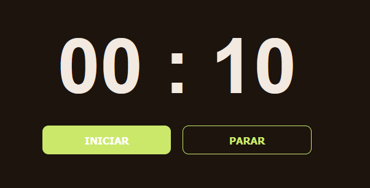

# 100-PROYECTOS-HTML-CSS-JAVASCRIPT

CURSO DE VICTOR-ROBLES

### 📁 CONTADOR | HTML - CSS - JS

###### Cronometro en HTML, CSS, JS con controles para iniciar y parar.

> Se practico eventos y funciones con JS

`addEventListener('click)`, `setInterval()`, `clearInterval()`

